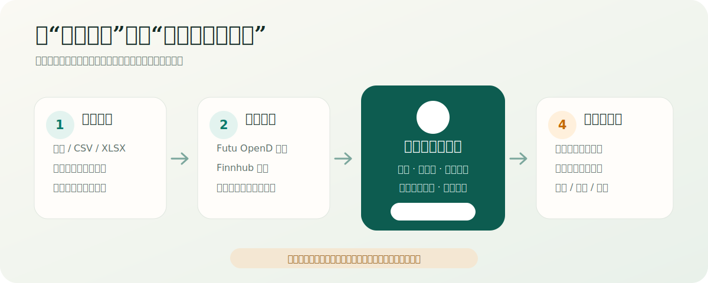

# OpenStock 个人投资决策台

> 把已确认持仓、行情新鲜度和透明风险规则整理成一个最多三项的“今天该处理什么”收件箱。




## 项目定位

OpenStock 不是行情大屏，也不是自动交易机器人。它面向单用户投资复盘场景，解决三个更具体的问题：

- 当前持仓中，今天真正需要优先处理的是哪几项？
- 建议依赖的数据是否足够新、来源是否可靠、为什么会触发？
- 当数据不足时，系统能否明确停止计算，而不是给出看似精确的交易数量？

系统不会连接真实下单。所有订单内容都只是不可执行草案，必须由用户在券商端复核并手动操作。

## 三个核心页面

### 决策

首页最多展示三条当前优先事项。每条决策包含动作、当前/目标仓位、数量变化、限价区间、触发条件、失效条件、有效期、数据质量和判断依据。

用户可以记录“已执行”“稍后处理”或“否决”。这些反馈只用于审计和复盘，不会让系统私自训练策略或修改风险规则。

### 持仓

按账户和市场保留原币数量、价格与市值，并提供明确标注的人民币估算、市场敞口和主题集中度。持仓来自人工确认的账户快照，不会假装已经直连券商账户。

### 机会

观察名单与持仓风险彻底分开。机会页展示用户主动关注的标的、候选条件和 30/90 日趋势；它不会挤占首页的持仓风险名额，也不会因为模型生成一段文字就变成可执行建议。

## 数据与决策流程

1. **导入账户快照**：支持截图、CSV 和 XLSX；多张图片可一次预览。
2. **人工确认**：识别结果必须在确认表中修正后才能成为新快照。
3. **同步行情**：Futu OpenD 为主源，Finnhub 为回退；每条数据记录来源、时间和降级状态。
4. **执行规则**：仓位、集中度、数据过期和用户确认的风险条件由确定性代码计算。
5. **生成解释**：可选的 OpenAI-compatible 模型只解释公开证据，不能改变价格、仓位、数量、优先级或有效期。
6. **进入收件箱**：只有数据和规则都满足要求的事项才可操作；其余明确显示“需要核验”或“不可操作”。

## 投资决策政策

设置页公开展示系统采用的结构化政策，而不是把判断隐藏在提示词中。每个持仓可以分别维护投资论文、A/B/C 信息等级、研究置信度、投资确定性、最强反方、Bear/Base/Bull 三情景，以及买入、减仓和退出条件。

- 集中度和异常波动只触发复核，不会机械产生买卖结论。
- 长期股票触及价格线默认复核或暂停加仓；只有权证、牛熊证或用户明确标记的战术止损允许硬退出语义。
- 低于目标仓位不能单独触发加仓；还必须满足用户确认的买入/加仓条件和有效数据。
- 清仓会停用旧规则，重新持有不会自动恢复旧论文。
- 大模型只能润色标题和摘要，不能改变动作、数量、风险级别、触发依据、当前限制或失效条件。

完整语义见 [`docs/investment-decision-policy.md`](docs/investment-decision-policy.md)。

## 数据质量语义

| 情况 | 系统行为 |
| --- | --- |
| 持仓快照超过 24 小时 | 不生成精确股数，要求重新同步账户 |
| 盘中行情在允许监控窗口内 | 可用于组合风险复核 |
| 市场已收盘且存在近期收盘价 | 仅用于参考性风险复盘 |
| 缺少可靠买一/卖一 | 不生成具体限价订单草案 |
| OpenD、新闻或模型不可用 | 显示降级来源；本地规则仍可运行 |
| 标的身份或产品条款不完整 | 标记为不可操作，不猜测产品含义 |

“重新计算”表示重新读取当前快照和行情，对全部持仓执行透明、可配置的组合风险检查。它不是预测涨跌，也不会根据个股代码套用写死止损线。

## 技术架构

- `frontend/openstock`：Next.js 15、React 19 决策工作台。
- `src/trading_assistant`：FastAPI、行情适配、导入、调度和决策引擎。
- SQLite + SQLAlchemy + Alembic：账户快照、行情、决策、反馈和同步任务。
- Futu OpenD：港美股和可用市场的主行情源。
- Finnhub：主行情不可用时的补充来源。
- APScheduler：低频风险监控和按交易时段配置的完整分析。
- OpenAI-compatible API：可选解释层，不参与确定性数值计算。

前端保留了上游 OpenStock 的 AGPL-3.0 许可和作者归属，详见 `frontend/openstock/LICENSE` 与 `frontend/openstock/README.md`。

## 本地开发

### API

```powershell
git clone https://github.com/ddbbiii/semi-auto-trading-assistant.git
cd semi-auto-trading-assistant
python -m venv .venv
.\.venv\Scripts\Activate.ps1
pip install -e ".[dev]"
Copy-Item configs\local.env.example configs\local.env
python -m alembic upgrade head
trading-assistant-api
```

API 默认监听 `http://127.0.0.1:8765`，健康检查为 `/health`。

### 前端

```powershell
cd frontend\openstock
npm install
Copy-Item .env.example .env.local
npm run dev
```

浏览器打开 `http://localhost:3000`。

## 机会观察名单同步

机会页的持久来源是数据库中的有序观察名单。仓库提供 `scripts/sync-opportunity-watchlist.ps1`，可以把一份结构化 Markdown 观察名单校验后通过 SSH 原子同步到服务器。

脚本只上传代码、名称、市场、优先级与公开投资逻辑，不上传账户号、完整资产金额或账户截图。解析或网络失败时保留服务器原列表，不需要重启服务。

## 生产部署参考

项目按不使用 Docker 的轻量服务器部署设计：

- Next standalone：仅监听本机回环地址。
- FastAPI：仅监听本机回环地址。
- Futu OpenD：仅监听本机回环地址。
- Nginx：通过私网入口反向代理。
- SQLite 与审计数据：独立数据目录并定期原子备份。
- 密钥：权限为 `0600` 的环境文件，不进入 Git、SQLite 或前端设置页。

systemd、Nginx 和环境文件模板位于 `deploy/`。

## 验证

```powershell
.\.venv\Scripts\python.exe -m pytest
cd frontend\openstock
npx tsc --noEmit
npm run lint
npm test
npm run build
```

## 隐私与安全边界

- 决策引擎只处理已确认持仓，不逆向券商 App，也不自动下单。
- 模型只接收代码、比例、价格变化、规则结果和公开证据，不接收账户号或完整资产金额。
- 截图默认在确认流程中处理；启用视觉模型时必须由用户明确同意。
- 数据不足时宁可停止生成具体动作，也不以截图价、延迟价或不完整产品名称冒充实时依据。

本项目仅用于个人研究与复盘，不构成投资建议或券商服务。

## 许可证说明

`frontend/openstock` 继续遵守其上游 AGPL-3.0 许可证。仓库其余自研部分目前尚未单独指定许可证；在统一许可证确定前，不应假设这些目录自动获得复制、修改或分发授权。
